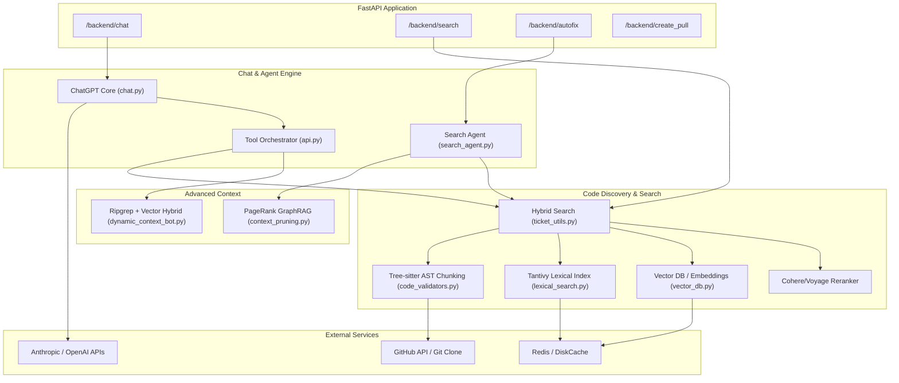
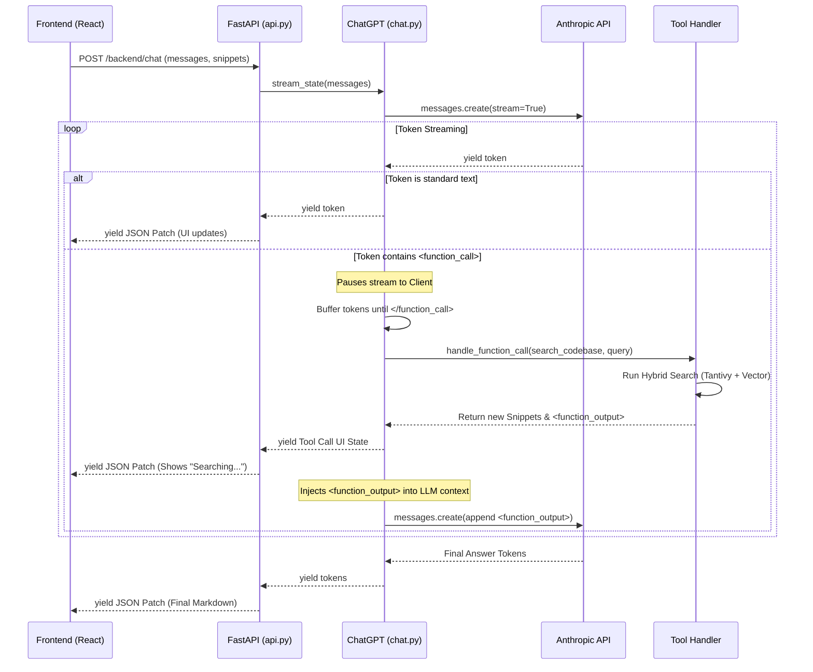
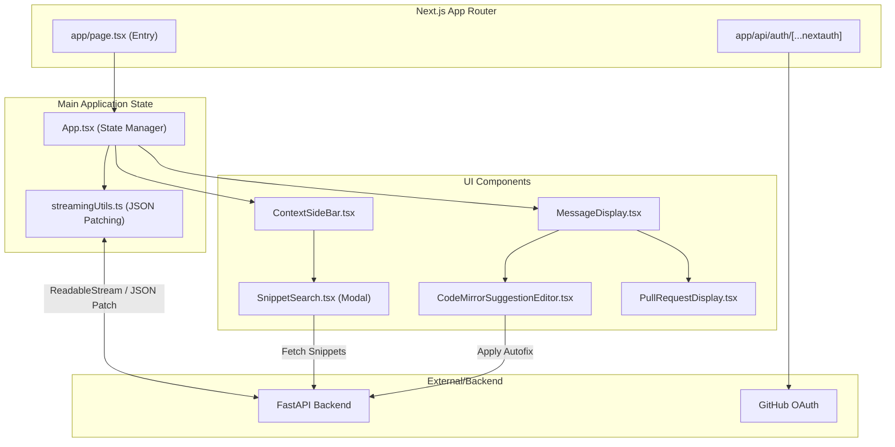
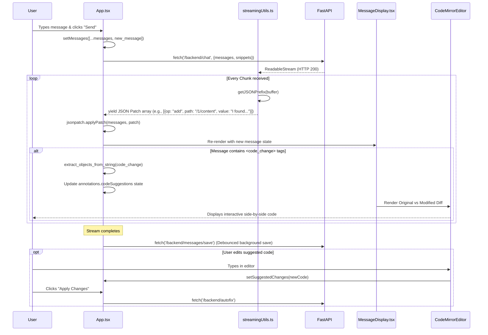

Here are the architectural and sequence diagrams for both the Backend and Frontend, based on the code provided in our chat. I have used Mermaid.js to visualize the systems.

---

### 1. Backend Architecture & Sequence

The backend is a FastAPI application that orchestrates a highly complex, agentic RAG (Retrieval-Augmented Generation) pipeline. It features a hybrid search engine, graph-based context pruning, and a streaming chat engine that intercepts tool calls mid-stream.

#### Backend Architecture Diagram

#### Backend Sequence Diagram: Streaming Chat with Mid-Stream Tool Calling
This diagram details the `/backend/chat` endpoint. Notice how the backend intercepts XML `<function_call>` tags *while* streaming to the user, executes the search, and injects the results back into the LLM without breaking the connection.

---

### 2. Frontend Architecture & Sequence

The frontend is a Next.js (App Router) application. It is designed as a real-time, reactive IDE. It uses `fast-json-patch` to handle streaming state updates efficiently and `CodeMirror` to render interactive code diffs.

#### Frontend Architecture Diagram

#### Frontend Sequence Diagram: Sending a Message & Rendering Diffs
This diagram shows what happens when a user types a message and hits "Send". It highlights the `fast-json-patch` streaming mechanism and how code suggestions are parsed and rendered into interactive CodeMirror editors.

### Key Architectural Takeaways:
1.  **JSON Patch Streaming:** Instead of sending the entire message string over and over (which is standard in basic ChatGPT clones), Sweep uses `fast-json-patch`. The backend calculates the diff of the state and streams only the patch. The frontend applies this patch to its local state. This is highly efficient for complex nested states (like tool calls and code suggestions).
2.  **Mid-Stream Interception:** The backend's ability to pause a stream, execute a tool, and resume the stream without the frontend having to orchestrate the tool call is a massive architectural advantage. It keeps the frontend "dumb" and the backend fully in control of the agentic loop.